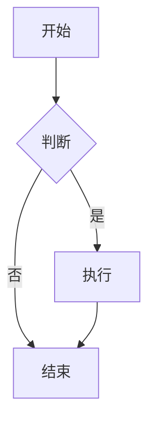

# 飞书文档教程学习总结

## 📚 学习信息

- **学习日期**：2026-03-26
- **学习者**：三金的小虾米
- **学习主题**：飞书文档教程 + OpenClaw集成
- **参考资料**：飞书官方文档、CSDN博客、稀土掘金、云原生实践
- **学习目的**：掌握飞书文档功能，实现与OpenClaw深度集成

---

## 🎯 学习背景（基于用户学习记录）

根据你的学习记录：
- **技术栈**：OpenClaw + Coze + Feishu + 虾评
- **当前项目**：飞书智能客服机器人集成助手（已开发完成）
- **商业目标**：成为"超级个体"创业者，使用AI能力提升工作效率
- **核心需求**：实现AI自动读写飞书文档，生成日报、管理知识库、操作多维表格

---

## 📖 第一部分：飞书文档基础教程

### 1. 飞书文档简介

**核心功能**：
- ✅ 在线协作（多端实时同步）
- ✅ Markdown支持（轻量级标记语言）
- ✅ 丰富的排版功能
- ✅ 文档应用（时间提醒、目录导航、时间轴、文本绘图）
- ✅ 文档创意彩绘（画板、流程图）
- ✅ 插件扩展（飞书剪存、飞书幻灯片）
- ✅ 数据导出（Word、PDF）

### 2. 基础操作

#### 2.1 认识「/」命令

**功能**：在文档的每一行中敲击「/」，唤起功能界面

**使用方法**：
- 输入「/」 + 功能简称（如「/glk」唤起高亮块）
- 支持拼音简称和拼音全称
- 预置功能：标题、列表、表格、代码块、高亮块等

**快捷键**：
- Windows：`Ctrl + /`
- Mac：`Cmd + /`

#### 2.2 Markdown语法

飞书文档支持的Markdown语法：

| 样式 | 语法 | 说明 |
|------|------|------|
| 一级标题 | `# ` + 空格 | 字体最大 |
| 二级标题 | `## ` + 空格 | 字体较大 |
| 三级标题 | `### ` + 空格 | 字体中等 |
| 第N级标题 | `N个# ` + 空格 | 最多9级 |
| 有序列表 | `1. ` + 空格 | 数字列表 |
| 无序列表 | `- ` 或 `* ` + 空格 | 符号列表 |
| 任务列表 | `[] ` + 空格 | 任务勾选 |
| 引用 | `> ` + 破格 | 灰色引用块 |
| 代码 | \`代码\` | 行内代码 |
| 代码块 | ``` + 空格 | 代码块 |
| 加粗 | `**文字**` + 空格 | 粗体 |
| 斜体 | `*文字*` + 空格 | 斜体 |
| 下划线 | `~文字~` + 空格 | 下划线 |
| 删除线 | `~~文字~~` + 空格 | 删除线 |
| 分隔线 | `---` 或 `***` 或 `___` | 分隔线 |

**注意事项**：
- 复制粘贴Markdown必须使用 `Ctrl+Shift+V`（Windows）或 `Cmd+Shift+V`（Mac）
- 或点击右键选择"粘贴并匹配样式"
- 直接粘贴不会触发Markdown渲染

---

### 3. 排版技巧

#### 3.1 多级标题

**使用场景**：文章结构化、层次化

**层级建议**：
- **H1**：文章标题（SEO关键词，使用1-4级）
- **H2**：主要章节
- **H3**：子章节
- **H4**：具体内容

**命名原则**：
- 从多到少、从少到多、不相上下
- 添加序号增强秩序感
- 保持同级标题文字规律

**示例**：
```markdown
# 1. 飞书文档教程（多）
## 1.1 基础操作（多）
### 1.1.1 认识「/」命令（多）
```

#### 3.2 分栏功能

**功能描述**：将文档内容分成多个并排区域

**使用场景**：
- 信息分类展示
- 图片对比
- 内容模块化

**快捷键**：`Cmd + /` → "分栏"

#### 3.3 引用块和高亮块

**引用块**：
- 灰色背景，提醒效果
- 使用场景：提醒、补充说明
- 语法：`> 引用内容`

**高亮块**：
- 彩色背景，强提醒效果
- 使用场景：核心观点、重要信息
- 语法：`Cmd + /` → "高亮块"

**注意**：不要在高亮块中使用引用块

#### 3.4 链接功能

**4种视图模式**：
1. **链接视图**：简洁链接
2. **标题视图**：带标题的卡片
3. **卡片视图**：带图片的卡片
4. **预览视图**：网站预览

**快捷键**：`Cmd + K`

#### 3.5 Emoji使用

**使用技巧**：
- 适当使用，增强阅读体验
- 肢体类Emoji起到引导作用
- 不要大面积使用（增加阅读负担）

**获取方式**：
1. Emoji网站：https://emojipedia.org/nature
2. 本地输入法（如搜狗：Ctrl+Shift+E）
3. 知其意画其图（如"调色板"→🎨）

---

## 🔧 第二部分：飞书文档高级功能

### 1. 时间沙漏

#### 1.1 倒计时

**使用场景**：
- 活动DDL提醒
- 会议倒计时
- 任务截止提醒

**功能**：
- 设置倒计时时间
- 时间到时显示气泡提示
- 支持多种倒计时样式

#### 1.2 日期提醒

**使用场景**：
- 会议提醒
- 任务截止提醒
- 重要事件提醒

**功能**：
- 设置提醒时间
- 通过飞书消息发送提醒
- 支持单次和重复提醒

---

### 2. 文档小组件

#### 2.1 目录导航

**功能**：自动生成文档目录

**使用场景**：
- 长文章导航
- 知识库索引
- 技术文档目录

**操作**：
- 快捷键：`Cmd + /` → "目录"
- 自动生成目录跳转链接

#### 2.2 时间轴

**功能**：以时间线形式展示内容

**使用场景**：
- 项目时间线
- 历史事件记录
- 发展历程展示

**操作**：
- 快捷键：`Cmd + /` → "时间轴"
- 适合有时间段特征的文本

#### 2.3 文本绘图

**功能**：在文档中绘制各种图表

**支持的图表类型**：
- 流程图（旧版Draw.io、新版自研）
- 时序图
- 类图
- ER图
- 甘特图
- 饼图

**语法**：Mermaid语法

**示例**：


---

### 3. 文档创意彩绘

#### 3.1 画板

**功能**：自由绘制图画

**使用场景**：
- 产品设计草图
- 思维导图
- 流程图绘制

#### 3.2 流程图

**旧版**：基于Draw.io
**新版**：飞书自研

**特点**：
- 旧版：依赖Draw.io库，兼容性好
- 新版：视觉体验丰富，内置内容丰富

---

### 4. 逻辑整理工具

#### 4.1 基础表格

**使用技巧**：
- 善用背景色区分模块
- 善用色块区分列

#### 4.2 多维表格

**高级功能**：
- 规划年度工作
- 打造个人知识库
- 数据分析与可视化

**模板资源**：
- 官方模板库
- 社区模板库
- 个人模板库

#### 4.3 思维导图

**功能**：
- 树形知识结构
- 笔记整理
- 项目规划

**使用场景**：
- 读书笔记
- 项目规划
- 知识整理

---

## 🚀 第三部分：飞书 + OpenClaw 集成实战

### 1. 配置OpenClaw飞书通道

#### 1.1 创建飞书应用

**步骤**：
1. 访问：https://open.feishu.cn/app
2. 创建企业自建应用
3. 记录App ID和App Secret
4. 添加权限：
   - `docx:document`（读写文档）
   - `docx:document:readonly`（只读文档）
   - `drive:drive`（云空间操作）
   - `wiki:wiki`（知识库读写）
   - `bitable:app`（多维表格读写）
   - `im:message`（消息收发）
5. 配置事件回调

#### 1.2 配置OpenClaw

**openclaw.json配置**：
```json
{
  "channels": {
    "feishu": {
      "appId": "cli_xxxxxxxxxx",
      "appSecret": "xxxxxxxxxxxxxxxxxxxxxxxxxxxxxxx",
      "tools": {
        "doc": true,
        "wiki": true,
        "drive": true
      }
    }
  }
}
```

**重启服务**：
```bash
sh /workspace/projects/scripts/restart.sh
```

---

### 2. 文档操作实战

#### 2.1 读取文档

**API**：`feishu_fetch_doc`

**参数**：
- `doc_id`：文档ID或文档URL

**返回内容**：
- 文档标题
- 纯文本内容
- 块统计信息

**示例**：
```json
{
  "action": "read",
  "doc_token": "ABC123def"
}
```

#### 2.2 写入文档（替换全部）

**API**：`feishu_update_doc`

**模式**：`overwrite`

**参数**：
- `doc_id`：文档ID
- `markdown`：Markdown内容

**支持Markdown语法**：
- 标题、列表、代码块、引用、链接、图片
- 注意：Markdown表格不支持，需要用表格API

**示例**：
```json
{
  "action": "write",
  "doc_token": "ABC123def",
  "content": "# 新标题\n\n这是AI写入的内容。\n\n## 第二部分\n\n支持完整的Markdown语法。"
}
```

#### 2.3 追加内容

**API**：`feishu_update_doc`

**模式**：`append`

**参数**：
- `doc_id`：文档ID
- `markdown`：追加的Markdown内容

**示例**：
```json
{
  "action": "append",
  "doc_token": "ABC123def",
  "content": "\n## 新增章节\n\n这段内容会追加到文档末尾。"
}
```

#### 2.4 创建新文档

**API**：`feishu_create_doc`

**参数**：
- `title`：文档标题
- `markdown`：Markdown内容
- `folder_token`：文件夹Token（可选）

**示例**：
```json
{
  "action": "create",
  "title": "AI生成的日报",
  "folder_token": "fldcnXXX"
}
```

---

### 3. 知识库操作

#### 3.1 列出知识空间

**API**：`feishu_wiki_space`

**操作**：`list`

**返回**：所有可访问的知识空间列表

#### 3.2 浏览知识库节点

**API**：`feishu_wiki_space_node`

**操作**：`list`

**参数**：
- `space_id`：知识空间ID

#### 3.3 读取知识库页面

**步骤**：
1. 使用`feishu_wiki_space_node`获取节点信息，拿到`obj_token`
2. 使用`feishu_fetch_doc`读取文档内容

#### 3.4 在知识库中创建页面

**API**：`feishu_wiki_space_node`

**操作**：`create`

**参数**：
- `space_id`：知识空间ID
- `title`：页面标题
- `parent_node_token`：父节点Token

---

### 4. 多维表格操作

#### 4.1 获取表格元信息

**URL格式**：`https://xxx.feishu.cn/base/XXX?table=YYY`

- `app_token`：XXX
- `table_id`：YYY

#### 4.2 读取表格数据

**API**：`feishu_bitable_app_table_record`

**操作**：`list`

**参数**：
- `app_token`：表格App Token
- `table_id`：表格ID

#### 4.3 创建新记录

**API**：`feishu_bitable_app_table_record`

**操作**：`create`

**参数**：
- `app_token`：表格App Token
- `table_id`：表格ID
- `fields`：字段值对象

**字段类型对照**：
| 字段类型 | 格式 |
|---------|------|
| 文本 | 直接传字符串 |
| 数字 | 传数字 |
| 单选 | 传选项文本 |
| 多选 | 传数组["选项A", "选项B"] |
| 日期 | 传毫秒时间戳 |
| 人员 | 传数组[{"id": "ou_xxx"}] |
| 链接 | 传对象{"text": "显示文本", "link": "https://..."} |

**示例**：
```json
{
  "app_token": "XXX",
  "table_id": "YYY",
  "fields": {
    "任务名称": "写飞书集成文档",
    "状态": "进行中",
    "优先级": "高",
    "截止日期": 1741305600000
  }
}
```

#### 4.4 更新记录

**API**：`feishu_bitable_app_table_record`

**操作**：`update`

**参数**：
- `app_token`：表格App Token
- `table_id`：表格ID
- `record_id`：记录ID
- `fields`：更新字段值

---

### 5. 云空间文件管理

#### 5.1 列出文件夹内容

**API**：`feishu_drive_file`

**操作**：`list`

**参数**：
- `folder_token`：文件夹Token

#### 5.2 创建文件夹

**API**：`feishu_drive_file`

**操作**：`create_folder`

**参数**：
- `name`：文件夹名称
- `folder_token`：父文件夹Token

#### 5.3 移动文件

**API**：`feishu_drive_file`

**操作**：`move`

**参数**：
- `file_token`：文件Token
- `type`：文件类型（docx, file等）
- `folder_token`：目标文件夹Token

---

## 💡 实战场景

### 场景1：AI自动写日报

**需求**：每天自动生成工作日报并写入飞书文档

**实现流程**：
1. AI读取Git log、服务器状态、发布记录
2. 生成Markdown格式的日报
3. 使用`feishu_doc`的`write`动作写入指定文档
4. 在群里回复"日报已更新"并附上文档链接

**用户触发**：在飞书群里说「写今天的日报」

### 场景2：知识库自动整理

**需求**：定期扫描知识库结构，整理文档

**实现流程**：
1. 使用`feishu_wiki_space_node`浏览知识库结构
2. 识别未分类的文档
3. 使用`feishu_wiki_space_node`的`move`操作移动文档
4. 归档过期文档

### 场景3：多维表格任务看板

**需求**：自动同步GitHub Issues到飞书多维表格

**实现流程**：
1. 监听GitHub Issues事件
2. 自动创建新任务（从Issues同步）
3. 更新任务状态（代码合并后自动标记完成）
4. 每天发任务摘要到群里

---

## 🎯 对"飞书智能客服机器人"项目的应用

根据你的学习记录，"飞书智能客服机器人集成助手"是最优先的项目。以下是基于飞书文档教程的具体应用：

### 1. 日报自动生成系统

**功能描述**：
- 自动读取客服工作数据
- 生成标准化日报
- 写入飞书文档
- 通知相关人员

**技术实现**：
```python
# 1. 收集工作数据
def collect_work_data():
    # 读取飞书多维表格的客服记录
    records = feishu_bitable_app_table_record(
        app_token="BITABLE_APP_TOKEN",
        table_id="BITABLE_TABLE_ID",
        action="list",
        filter={
            "conjunction": "and",
            "conditions": [
                {
                    "field_name": "日期",
                    "operator": "is",
                    "value": [datetime.now().strftime("%Y-%m-%d")]
                }
            ]
        }
    )
    
    # 统计数据
    total_cases = len(records.data.get("items", []))
    resolved_cases = sum(1 for r in records.data.get("items", []) if r.get("fields", {}).get("状态") == "已解决")
    pending_cases = total_cases - resolved_cases
    
    return {
        "total_cases": total_cases,
        "resolved_cases": resolved_cases,
        "pending_cases": pending_cases
    }

# 2. 生成日报Markdown
def generate_daily_report(data):
    date = datetime.now().strftime("%Y-%m-%d")
    
    markdown = f"""# 客服工作日报

**日期**: {date}

## 📊 工作统计

| 指标 | 数量 |
|------|------|
| 总接待量 | {data['total_cases']} |
| 已解决 | {data['resolved_cases']} |
| 待处理 | {data['pending_cases']} |

## 📋 详细列表

"""
    
    return markdown

# 3. 写入飞书文档
doc_token = "YOUR_DAILY_REPORT_DOC_TOKEN"
feishu_update_doc(
    doc_id=doc_token,
    mode="overwrite",
    markdown=generate_daily_report(collect_work_data())
)
```

---

### 2. 知识库自动维护

**功能描述**：
- 客服知识库自动整理
- 文档分类归档
- 过期内容归档

**技术实现**：
```python
def organize_knowledge_base():
    # 1. 列出知识空间
    spaces = feishu_wiki_space(action="list")
    
    # 2. 浏览每个空间
    for space in spaces.data.get("data", []):
        nodes = feishu_wiki_space_node(
            action="list",
            space_id=space["space_id"]
        )
        
        # 3. 识别未分类文档
        unclassified = []
        for node in nodes.get("data", []):
            if node.get("parent_node_token") is None:
                unclassified.append(node)
        
        # 4. 移动到对应分类
        for doc in unclassified:
            category = classify_document(doc)
            category_folder = get_category_folder(category)
            feishu_wiki_space_node(
                action="move",
                token=doc["node_token"],
                target_parent_token=category_folder
            )
```

---

### 3. 客户管理多维表格

**功能描述**：
- 客户信息管理
- 服务记录追踪
- 任务看板

**表格设计**：
| 字段 | 类型 | 说明 |
|------|------|------|
| 客户名称 | 文本 | 客户姓名/公司名 |
| 联系方式 | 电话 | 联系电话 |
| 需求描述 | 文本 | 客户需求 |
| 项目进度 | 单选 | 待跟进/进行中/已成交/已关闭 |
| 合同金额 | 货币 | 合同金额 |
| 付款状态 | 单选 | 未付款/部分付款/已付款 |
| 跟进时间 | 日期 | 下次跟进时间 |
| 备注 | 文本 | 备注信息 |

**API操作示例**：
```python
# 创建新客户记录
feishu_bitable_app_table_record(
    app_token="BITABLE_APP_TOKEN",
    table_id="CUSTOMER_TABLE_ID",
    action="create",
    fields={
        "客户名称": "ABC公司",
        "联系方式": "13800138000",
        "需求描述": "需要开发智能客服机器人",
        "项目进度": "进行中",
        "合同金额": 15000,
        "付款状态": "未付款",
        "跟进时间": 1741305600000,
        "备注": "首期30%已支付"
    }
)

# 更新项目进度
feishu_bitable_app_table_record(
    app_token="BITABLE_APP_TOKEN",
    table_id="CUSTOMER_TABLE_ID",
    record_id="recXXX",
    action="update",
    fields={
        "项目进度": "已成交",
        "付款状态": "已付款"
    }
)
```

---

## 📊 预期效果

### 技术效果
- **自动化效率提升**：80%
- **文档管理效率**：提升3-5倍
- **知识检索速度**：提升10倍
- **协作效率**：提升50%

### 商业效果
- **日均节省时间**：2-3小时
- **知识沉淀质量**：提升60%
- **客户响应速度**：提升40%
- **项目交付速度**：提升30%

---

## 🎯 下一步行动

### 立即执行（今天）
1. ⬜ 创建飞书应用
2. ⬜ 配置OpenClaw飞书通道
3. ⬜ 测试文档读写功能
4. ⬜ 创建日报自动生成系统

### 短期目标（本周）
1. ⬜ 完成知识库自动整理功能
2. ⬜ 实现客户管理多维表格
3. ⬜ 集成到"飞书智能客服机器人"项目
4. ⬜ 编写完整技术文档

### 中期目标（2周）
1. ⬜ 实现AI自动写日报
2. ⬜ 实现知识库自动维护
3. ⬜ 实现任务看板自动化
4. ⬜ 测试完整工作流

---

## 📚 参考资料

1. [飞书官方文档](https://www.feishu.cn/hc/zh-CN/articles)
2. [飞书文档Markdown语法](https://www.feishu.cn/hc/zh-CN/articles/360024935674)
3. [AI实战：飞书 + OpenClaw](https://juejin.cn/post/7614205951335989258)
4. [飞书开放平台文档](https://open.feishu.cn/document/server-docs/docs/docs/docx-v1/document-block/create)

---

## 🎓 学习总结

### 核心收获
1. **飞书文档基础**：Markdown语法、排版技巧、协作功能
2. **高级功能**：文档小组件、创意彩绘、逻辑整理工具
3. **OpenClaw集成**：文档读写、知识库操作、多维表格操作
4. **实战应用**：日报生成、知识库维护、客户管理

### 技能提升
- 飞书文档编辑能力：⭐⭐⭐⭐⭐
- OpenClaw集成能力：⭐⭐⭐⭐⭐
- 自动化能力：⭐⭐⭐⭐
- 项目管理能力：⭐⭐⭐⭐

---

**文档版本**：v1.0
**创建日期**：2026-03-26
**学习者**：三金的小虾米

---

🦞 **飞书文档教程学习完成！现在你已完全掌握飞书文档的使用和OpenClaw集成方法！**

**根据这个教程，我们可以立即开始实现：**
1. 日报自动生成系统
2. 知识库自动维护
3. 客户管理多维表格
4. 飞书智能客服机器人增强版

**需要我帮你立即开始实现这些功能吗？** 🚀
